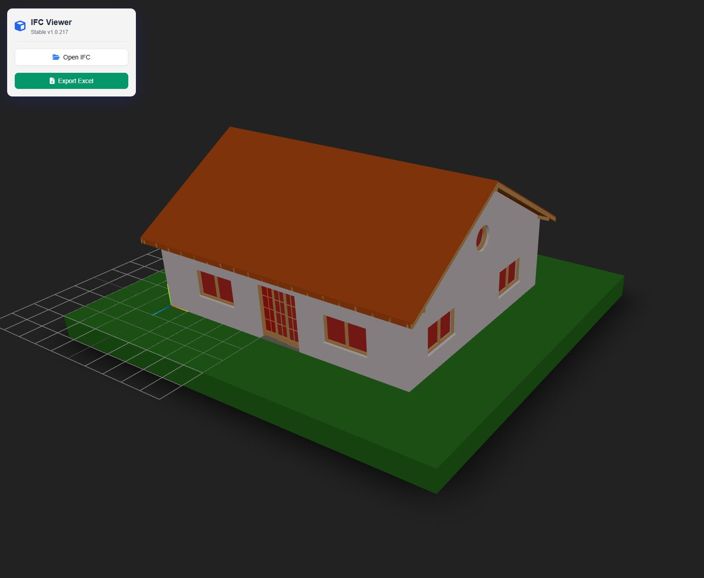

# IFC Viewer & Excel Exporter

A lightweight, browser-based BIM viewer that loads .ifc files locally and exports building data to Excel. Built with `web-ifc-three` and `SheetJS`, it runs entirely in the browser using ES Modules—no build tools or backend required.

- Deployed: [davras5.github.io/ifc-viewer/](https://davras5.github.io/ifc-viewer/)



## Features

- **Modern Glass UI**: A clean, floating interface built with Tailwind CSS and Glassmorphism effects.
- **Fast IFC Loading**: Uses [web-ifc](https://github.com/thatopen/engine_web-ifc) (WASM) to parse Industry Foundation Classes (IFC) files natively in the browser.
- **3D Navigation**: Smooth orbit controls with damping for intuitive model exploration.
- **Property Inspection**: Click any element to view its full set of IFC properties (Name, GlobalID, Dimensions, etc.) in a floating side panel with red highlight selection.
- **Excel Export**: Automatically scans the model for specific categories (Walls, Slabs, Doors, Windows, Columns, etc.) and extracts them into a formatted `.xlsx` report using SheetJS.
- **Sample Model**: Built-in sample IFC generator for quick testing without external files.
- **Zero-Install**: Single HTML file architecture using an Import Map. No Node.js build steps or bundlers required.

## Technology Stack

- **3D Core**: [Three.js](https://threejs.org/) (v0.155.0)
- **IFC Loader**: [web-ifc-three](https://github.com/IFCjs/web-ifc-three) (v0.0.126)
- **IFC Parsing**: [web-ifc](https://github.com/thatopen/engine_web-ifc) (v0.0.66 - WASM)
- **Raycast Acceleration**: [three-mesh-bvh](https://github.com/gkjohnson/three-mesh-bvh) (v0.5.23)
- **Excel Generation**: [SheetJS](https://sheetjs.com/) (v0.20.1)
- **Styling**: Tailwind CSS + FontAwesome 6.4.0 (via CDN)

## How to Run

Because this project uses ES Modules and loads WebAssembly (`.wasm`) files, browser security policies (CORS) prevent it from running directly from the file system (`file://`). You must use a local static server.

### Option 1: VS Code (Recommended)
1. Install the **"Live Server"** extension for VS Code.
2. Open the project folder.
3. Right-click `index.html` and select **"Open with Live Server"**.

### Option 2: Python
If you have Python installed, open your terminal in the project folder and run:

```bash
# Python 3
python -m http.server 8000
```

Then open `http://localhost:8000` in your browser.

### Option 3: Node.js
```bash
npx serve
```

## License

Licensed under [CC BY 4.0](https://creativecommons.org/licenses/by/4.0/).
