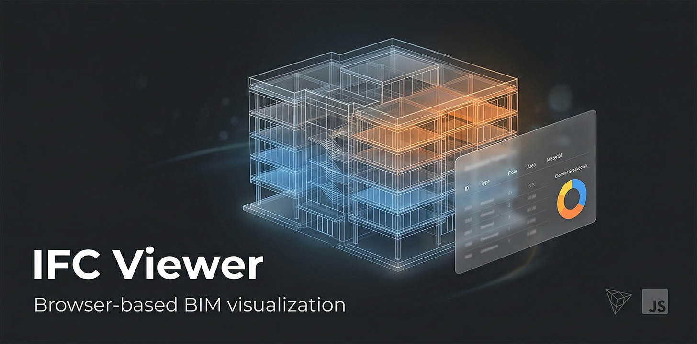
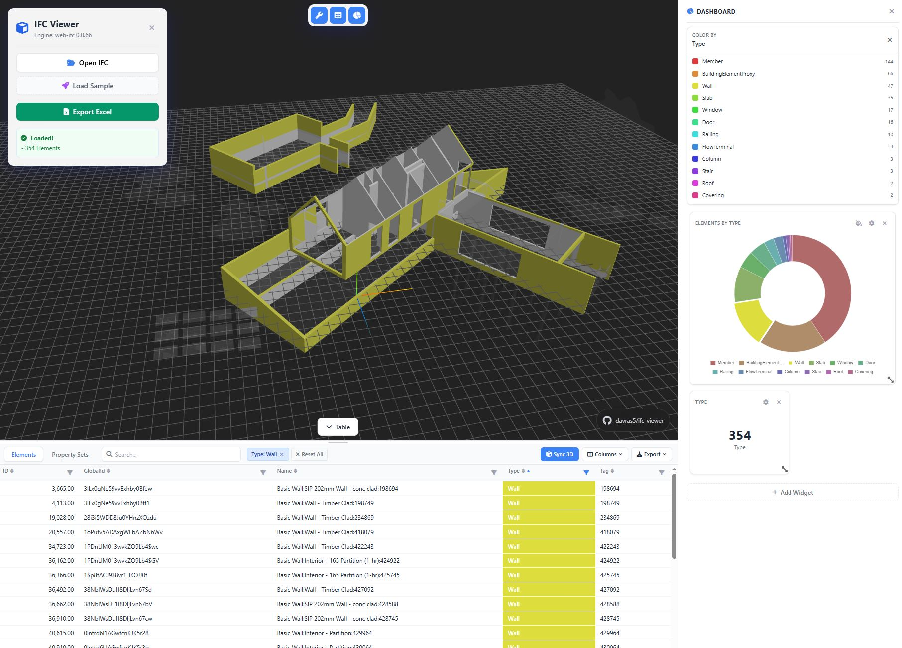
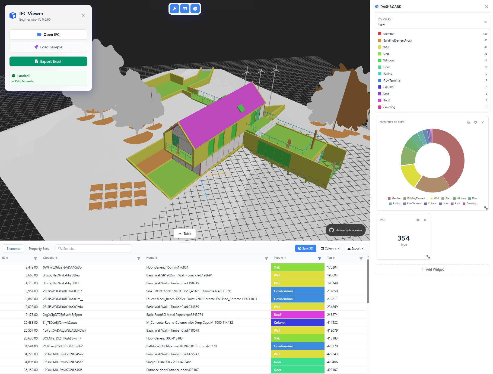
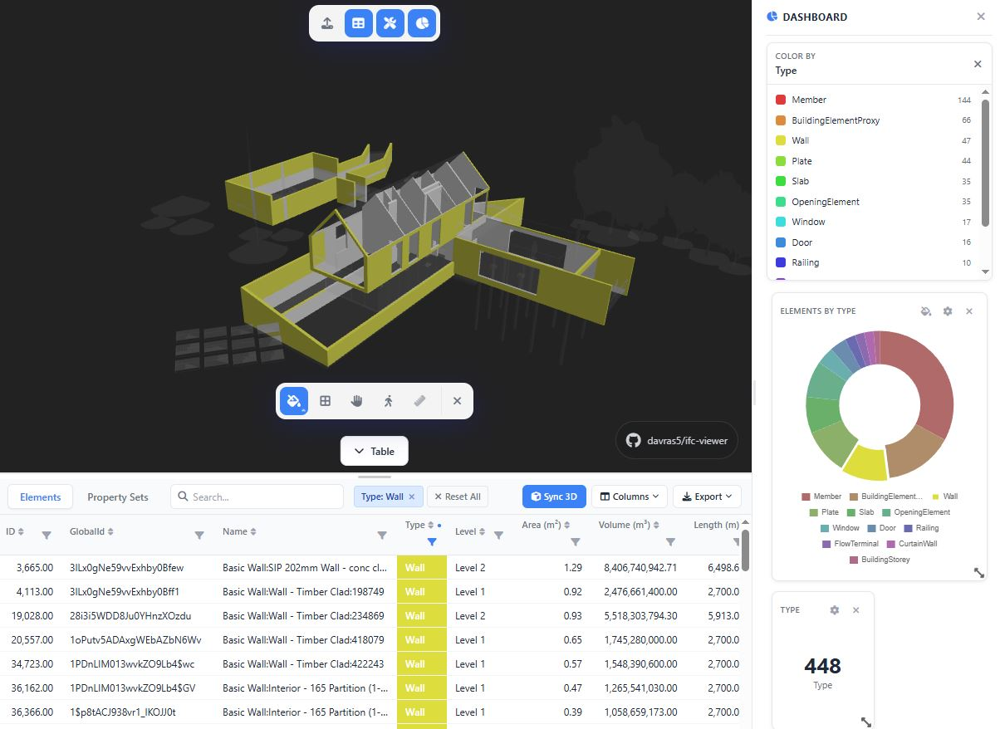

# IFC Viewer



A browser-based BIM viewer that loads IFC files locally with an interactive data table, color-by-attribute visualization, and Excel export. Built with `web-ifc-three` and `SheetJS` — runs entirely in the browser, no build tools or backend required.

- Deployed: [davras5.github.io/ifc-viewer/](https://davras5.github.io/ifc-viewer/)



<p align="center">
  
  
</p>

## Features

- **3D IFC Viewer** — Load `.ifc` files via drag-and-drop or file picker. Smooth orbit controls with damping. Click any element to highlight it and inspect its properties.
- **Sample Model** — Bundled full Revit architectural model (`assets/Ifc4_Revit_ARC.ifc`) for instant demo.
- **Data Table** — Toggleable split-panel table with two tabs:
  - **Elements** — ID, GlobalId, Name, Type, Tag for every building element.
  - **Property Sets** — Flattened property rows (PSet Name, Property, Value) per element.
  - Sortable columns, search bar, pagination, column visibility, and Excel/CSV export.
- **Filter by Column** — Click the filter icon on any column header to show/hide rows by value. Supports multi-column filtering with live search across unique values.
- **Color by Column** — Apply categorical or gradient coloring to 3D geometry based on any column attribute. Each unique value gets a distinct color mapped to both the 3D subsets and the table cells. A floating legend panel shows the full color mapping.
- **Bidirectional Selection** — Click a table row to highlight the element in 3D; click an element in 3D to highlight and scroll to its table row.
- **Property Inspector** — Floating side panel showing all IFC properties for the selected element.
- **Excel Export** — Scans the model for architectural categories (Walls, Slabs, Doors, Windows, Columns, etc.) and exports a formatted `.xlsx` report with property sets via SheetJS.
- **Loading Overlay** — Full-viewport spinner with progressive status messages during model parsing, data extraction, and color application.

## Project Structure

```
ifc-viewer/
├── index.html              — App shell (layout, controls, panels)
├── css/
│   ├── tokens.css          — Design tokens (colors, sizes)
│   └── main.css            — Layout, table, dropdown, legend styles
├── js/
│   ├── app.js              — Three.js scene, IFC loading, selection, color subsets
│   ├── table.js            — Table widget (tabs, search, sort, filter, color-by, pagination)
│   └── color-palette.js    — HSL palette generation for categorical/gradient coloring
└── assets/
    └── Ifc4_Revit_ARC.ifc  — Sample Revit model
```

## Technology Stack

| Layer | Library | Version |
|-------|---------|---------|
| 3D Core | [Three.js](https://threejs.org/) | 0.155.0 |
| IFC Loader | [web-ifc-three](https://github.com/IFCjs/web-ifc-three) | 0.0.126 |
| IFC Parsing | [web-ifc](https://github.com/thatopen/engine_web-ifc) (WASM) | 0.0.77 |
| Raycast Acceleration | [three-mesh-bvh](https://github.com/gkjohnson/three-mesh-bvh) | 0.5.23 |
| Excel Generation | [SheetJS](https://sheetjs.com/) | 0.20.1 |
| Styling | Tailwind CSS + Font Awesome 6.4.0 | CDN |

## How to Run

This project uses ES Modules and WebAssembly, so it requires a local HTTP server (not `file://`).

### Option 1: VS Code (Recommended)
1. Install the **"Live Server"** extension.
2. Open the project folder.
3. Right-click `index.html` → **"Open with Live Server"**.

### Option 2: Python
```bash
python -m http.server 8000
```
Open `http://localhost:8000`.

### Option 3: Node.js
```bash
npx serve
```

## License

Licensed under [MIT](https://opensource.org/licenses/MIT)
